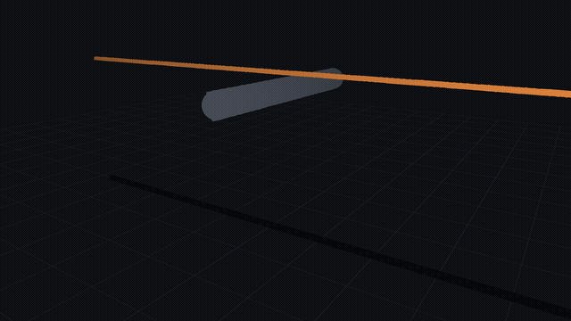
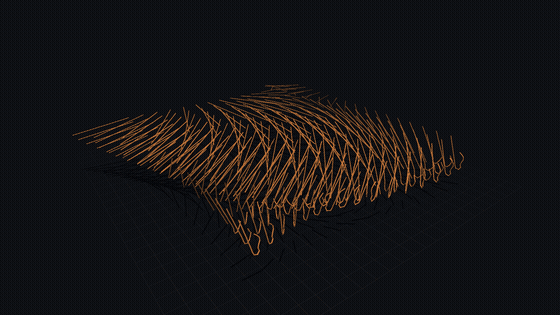
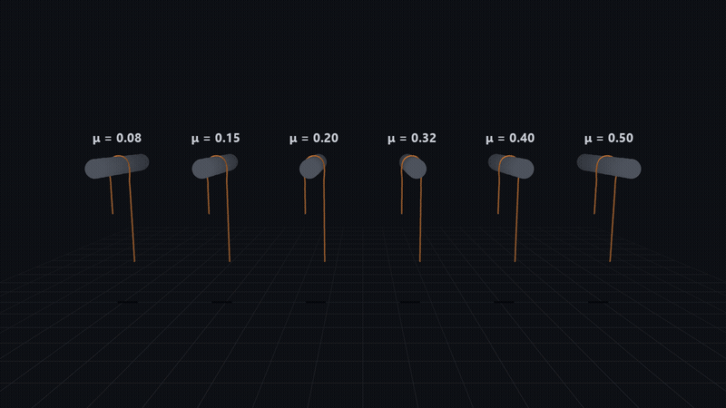
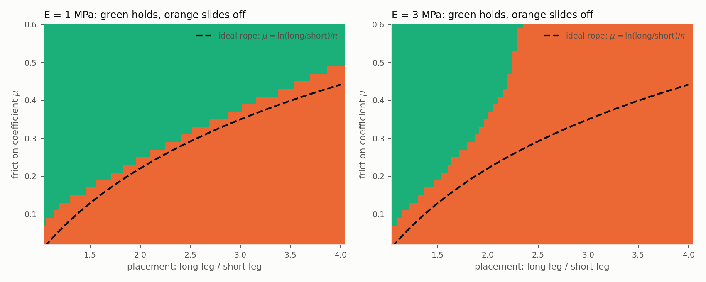
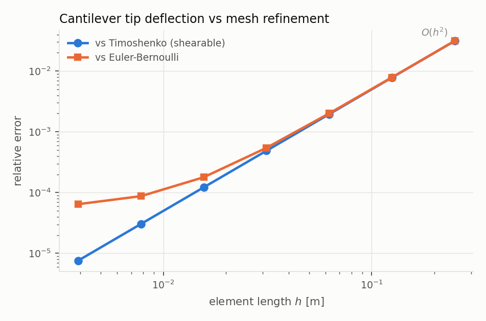
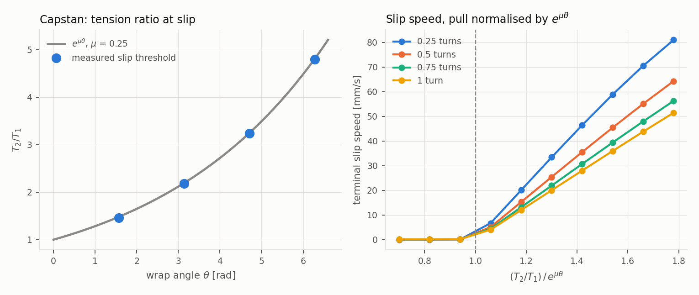
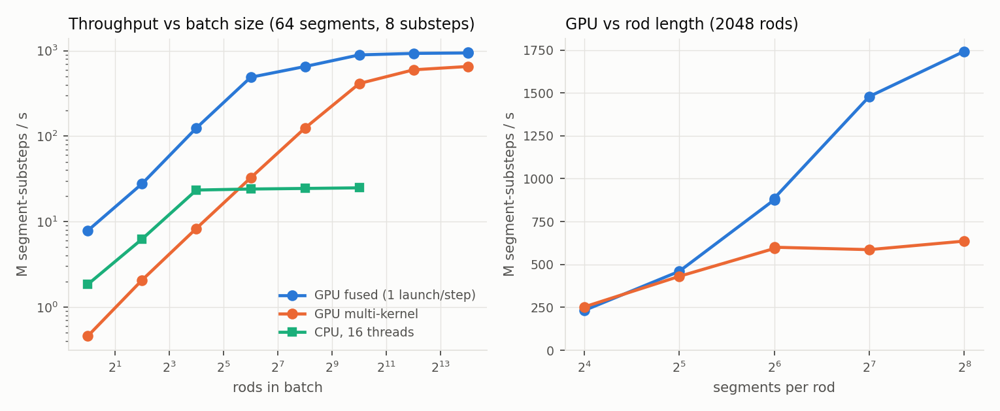

# RopePhysics — a validated rope and cable simulator for CPU and GPU

[](https://github.com/ahmedsleem109/RopePhysics/actions/workflows/validation.yml)

RopePhysics simulates **ropes, cables and other thin elastic rods**: they bend,
twist, stretch, hang, drape over objects, slide with friction and pile up on
themselves. It runs on the CPU and, batched across thousands of independent
rods, on an NVIDIA GPU.

What makes it different from a typical game-physics rope is that **every result
is checked against textbook physics**. There is a validation suite that compares
the simulator against exact solutions (beam bending, buckling, friction laws) and
fails if it drifts.

<table>
<tr>
<td width="50%"></td>
<td width="50%"></td>
</tr>
<tr>
<td><b>Cable over a post.</b> 120 segments with friction, floor contact and
self-collision. Simulated 3.3× faster than real time on one CPU thread.</td>
<td><b>256 rods at once.</b> Each rod is an independent simulation, the
workload a robot-learning batch looks like. 16 CPU threads here; the GPU runs
thousands (see <a href="#how-fast-is-it">How fast</a>).</td>
</tr>
</table>

Both clips are played back in real time and rendered offline from the
simulator's output (`rodsim scene drape|grid`, then
`tools/make_readme_media.py`).

---

## A real application: will this cable stay on the hook?

A robot, or a person, drapes a cable over a hook and lets go. The robot controls
**where it grasps the cable**, which sets how much hangs on each side. It does not
control **friction** or **how stiff the cable is**. Will the cable stay?



*Same cable, same 2:1 drape, six friction values. Rope theory (the capstan
equation) says it needs μ ≥ 0.22: the left three slide off, the right three hold.*

The GPU answers this for **3 600 placements at once**: 30 friction values × 60 grasp
positions × 2 cables, each simulated for 8 seconds after release. That takes
**under 2 minutes** on a laptop GPU.



- **The soft cable** (left) follows the textbook boundary (dashed line), slightly on
  the safe side. The simulator never says "holds" where theory says "slips".
- **The 3× stiffer cable** (right) is the reason to simulate. Hung more than about
  **2.3 : 1 off-centre, it slides off no matter how grippy the hook is**. The
  textbook formula cannot tell you that, because it ignores bending stiffness.

The same pattern applies to robot cable handling, wire-harness assembly, hanging
hoses and laundry: sweep the things you can't control, and learn which actions
are safe before the robot tries them. The case runs as `rodsim cable-hanging`.
It also checks the GPU against the double-precision CPU, including the placements
where single precision once got the answer wrong (see *Lessons learned*).

---

## What it can do

- **Bend, twist, stretch and shear** with real material constants (Young's
  modulus, Poisson ratio, density, radius). Stiffness does not change when you
  change the timestep or the number of segments.
- **Contact** with planes, spheres, capsules and boxes, with **Coulomb friction**
  (sticking and sliding).
- **Self-collision**, so a rope can coil into a pile without passing through
  itself.
- **Clamped, pinned, twisted and moving ends** (a gripper moving a cable), and
  applied forces and torques.
- **Batched GPU simulation**: thousands of rods stepped in parallel with every
  feature above (loads, driven ends, world contact, friction, self-collision),
  matching the CPU and bit-for-bit repeatable.
- **Direct static solver**: finds the resting shape of a loaded rod in
  milliseconds, used to check accuracy.

---

## How accurate is it?

Each row is a separate automated check in `rodsim all`, compared against an
independent reference. "Slope 2" means the error shrinks 4× every time the
segments are halved in length, as the theory says it should.

| test | compared against | result |
|---|---|---|
| Cantilever bending under a tip load | Timoshenko beam theory | error **7.6e-6** at 256 segments, slope **2.00**; same on any axis |
| Rod bent into a circle by an end moment | exact circle, radius `EI/M` | error **1e-4** at 128 segments, slope **2.01** |
| Large bending under a tip load | exact elastica | tip within **0.06%** of rod length |
| Rod with built-in curvature and twist | exact helix | radius to **2e-10**, pitch to **5e-4** |
| Twisted rod buckling | Michell/Greenhill threshold | **2.3%** at 32 segments, converging |
| Resting on plane, sphere, capsule, box | exact geometry | **2e-16** |
| Block on a slope | slips at `tan α = μ` | within **1.5%** |
| Rope wrapped around a post (capstan) | `T₂/T₁ = e^{μθ}` | within **1.6%**, 0.25 to 1 turn |
| Rope coiling into a pile | no self-penetration | worst overlap **0.18%** of diameter |
| Timestep accuracy (swinging cantilever) | strain error under 1% | limit at **1–3%** of a segment moved per substep |
| Independent NumPy re-implementation | same trajectory | **5e-13 m** apart after 200 steps |
| GPU vs CPU, with loads and a driven twist | same trajectory | **5e-8 m** after one step; drift matches float rounding |
| GPU vs CPU, rod resting on floor and sphere with friction | same trajectory | **1.6e-7 m** after 200 steps (contact itself moves it 1.3 cm) |
| GPU vs CPU, coiling rope with self-contact | same step | **6e-6 m**, inside float rounding (1.8e-5 m) |

<table>
<tr>
<td width="50%"></td>
<td width="50%"></td>
</tr>
<tr>
<td>Cantilever error falls at second order as segments shrink.</td>
<td>Friction around a post follows the capstan equation.</td>
</tr>
</table>

All data is in `docs/data/*.csv` and every figure in `docs/figs/`. The long-form
[writeup](docs/writeup.md) explains each test and what it caught.

---

## How fast is it?

Measured in **segment-substeps per second**: rods × segments × solver substeps
completed per second. 64-segment rods, 8 substeps.

| hardware | throughput |
|---|---|
| CPU, 16 threads | **25 M** /s |
| Laptop GPU (RTX 3060), 16 384 rods | **1.16 B** /s — about **47×** the CPU |
| Same GPU, 2 048 rods × 256 segments | **1.79 B** /s |
| Same GPU, 16 384 rods, contact with floor + sphere | **0.92 B** /s |
| Same GPU, 16 384 rods, contact + self-collision | about **0.09×** the plain rate |



The GPU has two strategies. **Multi-kernel** launches one small kernel per
constraint colour. **Fused** runs a whole timestep for a rod in one launch, in
fast shared memory. Fused wins everywhere: 11× faster for a single rod, where
launch overhead dominates, and 1.7× faster once the GPU is saturated. The
writeup explains the curves.

---

## Quick start

Requirements: Windows, CMake, Ninja, Visual Studio Build Tools (MSVC 14.44).
CUDA 13.1 is optional; without it the CPU simulator and all CPU tests still
build. The code also builds with g++ on Linux, which is what CI uses.

```bat
build.cmd                               :: configure + build into build\

build\rodsim.exe all                    :: run every test (exit code = failed checks)
build\rodsim.exe cantilever             :: run one test
build\rodsim.exe scene drape            :: simulate a demo scene into out\scenes

python tools\plot_validation.py         :: CSVs -> figures in docs\figs
python tools\make_readme_media.py       :: scenes -> GIFs in docs\media
python tools\make_video.py              :: scenes + figures -> out\video\demo.mp4
python tools\reference_prototype.py     :: cross-check against the NumPy version
```

The full suite takes about 17 minutes; almost all of that is twist buckling and
the capstan sweep. Python tools need `numpy`, `matplotlib`, `Pillow` and
`imageio-ffmpeg`.

---

## How it works

A rod is a chain of **particles** (positions) joined by **segments**, and each
segment carries a **material frame** (a quaternion) that records how the
cross-section is turned. Two constraints hold it together:

- **stretch/shear** keeps each segment its rest length and aligned with its frame;
- **bend/twist** penalizes how much one frame is rotated relative to the next.

Each step moves everything under gravity and then projects the constraints
(XPBD, Macklin et al. 2016/2019, with the Cosserat constraints of Kugelstadt &
Schömer 2016). Constraint stiffness comes straight from the material, so results
do not depend on timestep or resolution. On the GPU, constraints are split into
two "colours" that don't share any state, so each colour can be solved fully in
parallel.

<details>
<summary><b>The equations</b></summary>

```
stretch / shear   C_s = R(q_j)^T (x_{i+1} - x_i) / l  -  e3      (material frame)
bend / twist      C_b = (2 / lbar) Im(conj(q_a) q_b)  -  Omega_rest

alpha_s = diag( 1/(ks G A), 1/(ks G A), 1/(E A) ) / l
alpha_b = diag( 1/(E I),    1/(E I),    1/(G J) ) / lbar
alpha~  = alpha / h^2          (h = substep)
```

Both constraints are solved as 3×3 blocks, with Jacobians taken with respect to
body-frame rotation increments. With this compliance scaling the static
equilibrium contains neither `h` nor `l`.

Contacts are one uniform constraint (up to four particles with weights, one
normal), unilateral, with position-level Coulomb friction whose cone bounds the
*total* tangential correction per substep. Self-collision uses segment–segment
closest points behind a uniform spatial hash (key → counting sort → cell
offsets, the same three steps a GPU broadphase runs).

The derivations are in [`docs/writeup.md`](docs/writeup.md).
</details>

---

## Project layout

```
src/core/            the simulator (plain C++17, no dependencies)
  math3.h              vectors, matrices, quaternions — double on CPU, float on GPU
  rod.{h,cpp}          rod state, material, constraints, builders, clamped ends
  solver.{h,cpp}       XPBD time stepping, constraint and contact projection
  statics.{h,cpp}      direct static equilibrium (banded Newton)
  collision.{h,cpp}    primitives, contact generation, spatial hash
  coloring.{h,cpp}     constraint colouring for parallel solving
src/gpu/             CUDA port
  gpu_solver.cu        kernels: multi-kernel and fused strategies
  gpu_batch.cpp        host side: memory layout, upload/download, launches
src/validation/      every test case and the demo scenes
src/main.cpp         the `rodsim` command-line driver
tools/               plotting, rendering, video, NumPy cross-check, probes
docs/                writeup, data (CSV), figures, README media
.github/workflows/   CI: builds and runs the test suite on every push
```

---

## Lessons learned

<details>
<summary><b>Eight ways this simulator produced plausible-looking wrong answers, and how each was caught</b></summary>

1. **The clamp must sit where the continuum clamp sits.** Freezing the first
   segment's frame clamps at `s = l/2`, silently turning second-order
   convergence into first order. A ghost frame at `s = 0` fixes it.
2. **Static equilibrium is timestep-independent only once the system is
   solved.** An under-solved rod settles into a state that is too soft *and
   reports itself converged*.
3. **Buckling is a question for dynamics.** A heavily-iterated step damps
   genuinely unstable modes; an early version reported a threshold 18% low.
4. **Friction's cap bounds the total, not each iteration's share.** Otherwise a
   block sits motionless on a slope far steeper than `atan μ`.
5. **Self-collision must exclude neighbours by rest length, not index,** or a
   finely-divided rope pushes itself apart when nothing is touching.
6. **A stiffness must live in the frame it is defined in.** Stretch/shear strain
   was measured in world axes, so a rod along `x` was 3× too stiff in shear.
   Every test passed. Refining the cantilever to 256 segments exposed it.
7. **Several tests passed without testing anything,** such as a self-collision
   test with zero contacts. Each test now also asserts that the thing it
   measures actually happened.
8. **Single precision can invent friction.** On the GPU, a cable at rest could
   only move in steps of about 6e-8 m, while gravity moved it 4e-8 m per substep.
   The motion rounded away, so cables that slip in reality held on the GPU.
   Comparing against a double-precision CPU run caught it. The fix is fewer,
   larger substeps, and a check now asserts the margin.

</details>

---

## Status and limitations

**Working and validated:** CPU simulator, contact and friction,
self-collision, direct statics, GPU port (parity, determinism, throughput),
continuous integration.

**Open** (tracked in [`REMAINING.md`](REMAINING.md)):

- **The timestep guidance is one scenario deep.** To keep strain error under
  1%, material should move no more than about 1–3% of a segment length per
  substep. That was measured on a swinging cantilever only.
- **Self-collision is the expensive part on the GPU** (about 11× slower than a
  plain rod), because contact projection within one rod stays sequential to
  match the CPU exactly. There is no profiler study yet.
- **Friction creeps.** A cable resting on a bar slowly slides, about 2 mm/s even
  at twice the needed friction, so near the hold/slip boundary a cable can slide
  off after several seconds. Hold/slip answers are therefore reported for a
  stated time window (8 s) and err on the safe side. The likely cause is that
  contact is per particle: a rope over a bar rests on a few points, which keep
  changing.
- Contacts apply no torque to frames.
- The integrator dissipates energy slightly; this shrinks with more substeps.

Background: the original plan with its phase gates is in
[`gpu-cosserat-rod-simulator-plan.md`](gpu-cosserat-rod-simulator-plan.md).
