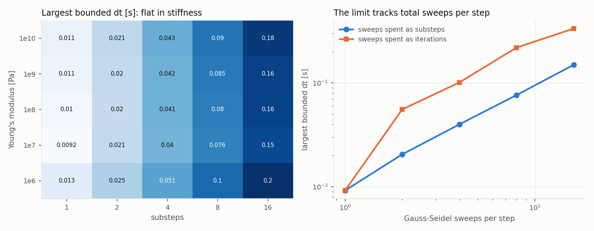
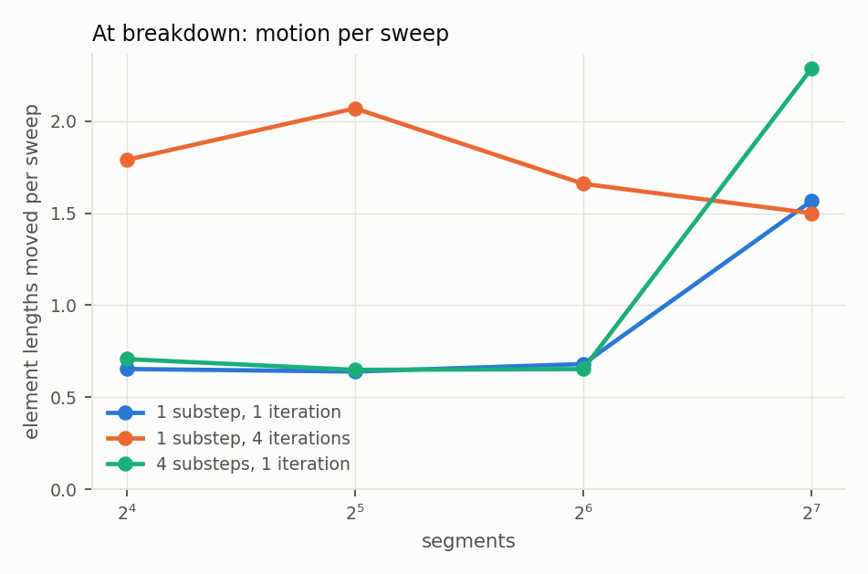

# A validated Cosserat rod solver, and what it took to trust it

This is the long-form companion to the [README](../README.md). It covers the
derivation, the compliance parameterization, contact and friction, the
constraint coloring and GPU design, what the measurements say about stability
and throughput, and — at the length it deserves — what is not established.

The short version of the method: every claim in this project is a number
produced by a case in `src/validation`, compared against a reference that does
not come from the solver. Several of those cases were wrong before they were
right, and the ways they were wrong are most of what is worth reading here.

---

## 1. The discrete rod

A rod of length `L` is split into `n` segments. It carries two kinds of state:

- `n + 1` **particles** `x_i` on the centerline, with masses lumped half and half
  from the adjacent segments;
- `n` **frames** `q_j`, unit quaternions mapping the segment's body frame to
  world. The body `e3` axis is the material tangent; `e1`, `e2` span the cross
  section. Each frame carries the body-frame inertia of a solid cylinder.

Two vector-valued constraints tie them together (Kugelstadt & Schömer 2016):

```
stretch/shear   C_s(x_i, x_{i+1}, q_j) = (x_{i+1} - x_i) / l  -  R(q_j) e3
bend/twist      C_b(q_a, q_b)          = (2 / lbar) Im(conj(q_a) q_b)  -  Omega_0
```

`C_s` is zero when the chord between particles has its rest length and points
along the frame's tangent: its two transverse components are shear, the axial
one is stretch. `C_b` is the discrete Darboux vector — the rotation carrying one
frame into the next, per unit length — minus its rest value. Its first two
components are curvature, the third is twist.

### Jacobians under body-frame perturbations

Orientations are perturbed on the right, `q ← q exp(δθ/2)`, with `δθ` in the
body frame. That choice is what lets the diagonal body-frame inverse inertia be
used everywhere without a change of basis. Differentiating:

```
dC_s/dx_i = -I/l      dC_s/dx_{i+1} = +I/l      dC_s/dθ_j = R(q_j) [e3]x

p = conj(q_a) q_b     (taken on the hemisphere of the identity)
dC_b/dθ_a = (1/lbar) (-p_w I + [p_v]x)
dC_b/dθ_b = (1/lbar) (+p_w I + [p_v]x)
```

For the stretch constraint the rotational block reduces to
`R diag(Iinv_y, Iinv_x, 0) R^T`. The zero is physics, not an accident: spinning a
segment about its own tangent does not move the tangent, so twist can only
enter through the bend/twist constraint.

The hemisphere choice matters. `q` and `-q` are the same rotation, but
`Im(conj(q_a) q_b)` flips sign between them, so without pinning the
representative the measured curvature can change sign mid-simulation.

### XPBD, with blocks

Each constraint is solved as a 3×3 system rather than component by component,

```
(J M^-1 J^T + alpha~) dlambda = -(C + alpha~ lambda)
```

by Cholesky. The system is SPD by construction: `J M^-1 J^T` is positive
semi-definite and the compliance on the diagonal is strictly positive. Solving
the block rather than its diagonal keeps the coupling between the shear and
stretch components, and between bending and twist, inside one projection.

The integrator is substepped XPBD (Macklin et al. 2019): predict with gravity
and body-frame gyroscopic terms, reset multipliers, run the Gauss–Seidel
sweeps, recover velocities from the position and orientation changes.

---

## 2. Compliance parameterization

The discrete elastic energy of an element is its length times the continuum
energy density:

```
E_s = (l / 2)    C_s^T diag(ks G A, ks G A, E A) C_s
E_b = (lbar / 2) C_b^T diag(E I, E I, G J)       C_b
```

XPBD writes an elastic potential as `E = ½ C^T alpha^-1 C`. Matching the two:

```
alpha_s = diag(1/(ks G A), 1/(ks G A), 1/(E A)) / l
alpha_b = diag(1/(E I),    1/(E I),    1/(G J))  / lbar
```

and XPBD uses `alpha~ = alpha / h²` with `h` the **substep**. At a static state
the XPBD fixed point reduces to `f_ext = J^T C / alpha`, which contains neither
`h` nor the number of segments. Stiffness is therefore the material's —
real `E`, `G`, `A`, `I`, `J` for a circular section — and a resolution sweep
changes the discretization error and nothing else.

That statement is exactly what the Phase 1 cases test, and it holds with two
conditions attached, both found the hard way.

**The system must actually be solved.** Gauss–Seidel on a rod is a chain, and a
sweep carries information about one element along it; the operator being
inverted is the fourth-order beam operator. An under-swept static relaxation
does not fail loudly. It settles into a stationary state that is genuinely too
**soft** and reports itself converged, because its velocities really are zero.
At `n = 64` a 512-sweep budget produced a 14% error that looked converged. The
`solver-convergence` case sweeps the budget explicitly, and the static cases use
a budget quadratic in `n`.

**The substep must be small enough for `alpha~` to dominate.** Even with
unlimited sweeps, a large substep left the pure-moment case with every joint
carrying 0.77% more moment than was applied — a converged, mesh-independent bias.
Quartering `h` removed it and restored second-order convergence.


### Boundary conditions

The frame of segment 0 lives at `s = l/2`, not `s = 0`. Freezing it clamps the
rod half an element in, shortens the effective cantilever to `L - l/2`, and puts
an error of about `-1.5 h/L` into every static deflection: first-order
convergence from a second-order discretization, on a plot that still looks
respectable. The fix is a **ghost frame** — an orientation element with zero
inertia at `s = 0` — tied to segment 0 through a half-length bend element. Ghost
frames are ordinary entries in the state arrays, so the solver has no special
case for them, and rotating one about the tangent is how twist is imposed.


---

## 3. Validation, Phase 1

| case | reference | result |
|---|---|---|
| cantilever | Euler–Bernoulli / Timoshenko | slope 2.23; 0.012% off E–B at n = 64 |
| pure end moment | exact circular arc of radius `EI/M` | slope 2.02 |
| tip-load elastica | exact planar elastica by shooting | worst 9.7e-4 L |
| helix | `R = κ/(κ²+τ²)`, pitch `2πτ/(κ²+τ²)` | 2.2e-10 and 5.2e-4 relative |
| twist buckling | clamped–clamped Michell threshold | 2.3% at n = 32, converging |
| energy | conservation invariants | momentum to 5e-10; dissipation and gain shrink with substeps |
| cross-check | independent NumPy implementation | 4.8e-13 m after 200 steps |

Three of these deserve comment.

**The helix** first reported an 8% radius error on a rod whose residual elastic
energy was `1.4e-20` of its scale. The solver had found the exact rest state;
the *measurement* was wrong, because averaging tangents estimates a helix axis
without bias only over a whole number of turns. The axis is now taken from the
frame rotation, which is exact, and the residual-energy check stays in the case
as the thing that separates solver errors from measurement errors.

**Twist buckling** (Michell/Greenhill). Linearizing the Kirchhoff equations about
a straight rod carrying twisting moment `M` gives `EI w'''' - i M w''' = 0` for the
complex lateral deflection. With both ends clamped the solvability condition is
`θ = 2 atan(θ/2) + 2π`, so `M_crit L / EI = 8.986819` — not the textbook `2π`,
which is the pinned case. This was verified two ways (closed form and a
determinant scan) before any simulation was trusted.

The case needed three rewrites. Rotating the end frame straight to 12 rad asked
one half-element to hold 1.9 turns; the discrete twist lives in
`Im(conj(q_a) q_b)`, representable only inside (−π, π), so the constraint wrapped
it and the rod stored no twist at all. Constructing the uniformly twisted state
directly fixed that. The next version used static relaxation and found the
threshold 18% low — but raising the damping made the "buckling" vanish, which no
physical instability does. A heavily-iterated XPBD step is close to backward
Euler, and backward Euler damps genuinely unstable modes. The final case runs
honest dynamics (256 substeps, one sweep, no damping) and bisects on growth of a
seeded perturbation. It also checks the twisted base state's stored energy
against the *discrete* prediction: the discrete twist measure `2 sin(φ/2)/lbar`
stores about 2% less than the continuum at half a radian per joint, an `O(h²)`
difference that a check against the continuum value would have flagged as a bug.


**Energy** is not conserved, and the case does not pretend otherwise. XPBD is not
symplectic: this rod dissipates its elastic oscillation throughout the run. What
is asserted is what holds — dissipation and any spurious energy *gain* both
shrink monotonically with substeps (gain is exactly zero at 16), and linear and
angular momentum are conserved to round-off and 5e-4 respectively.


---

## 4. Contact, friction, self-collision

Every contact is the same constraint: up to four particles with weights and one
fixed normal, linearized as `C(x) = Σ w_k (x_k · n) − offset`, with the offset set
so `C` equals the signed gap at generation time. A rod-vs-world contact uses one
particle; a self-contact uses the four end particles of two segments, with
negative weights on the second, so the same expression is the relative gap. One
struct, one projection routine, no branches — which is the shape a GPU kernel
wants.

The normal multiplier is clamped at zero: contacts push, never pull. Friction is
applied straight after each contact's normal solve, at the position level: the
tangential displacement accumulated since the substep began is undone up to the
Coulomb bound `μ λ_n w_eff`. One expression covers stick and slip.

**That bound limits the total, not each sweep's share.** The first
implementation applied a fresh cap every Gauss–Seidel sweep, letting a solver
with four iterations spend four times the Coulomb limit. Friction four times too
strong still looks like friction; the symptom was a block sitting motionless on a
slope far steeper than `atan μ`.

Rod–world contacts are generated per particle: to the world the rod is a chain
of spheres of its own radius. That is exact for a plane and accurate for smooth
convex shapes while segments are not much longer than their diameter.
Self-collision uses segment–segment closest points behind a uniform spatial hash
built as key → counting sort → cell offsets — the same three stages a GPU
broadphase runs as key kernel → radix sort → scan.

**Self-contact pairs must be excluded by rest length, not by index.** When
segments are shorter than the rope's diameter, segments two apart are closer than
`2r` at rest. Skipping only direct neighbours made the solver push apart a rope
that was not touching itself — 74 spurious contacts on an untouched rope. The
exclusion now spans a diameter of rest length.

| case | reference | result |
|---|---|---|
| primitives | exact rest height on plane, sphere, capsule, box | 5.1e-13; penetration 5e-17 m |
| incline | slip at `tan α = μ`; `a = g(sin α − μ cos α)` | slip angle within 2.0%, sliding μ within 2.2% |
| capstan | `T₂/T₁ = e^{μθ}` at slip | 1.6%, 0.6%, 0.3%, 0.3% at ¼, ½, ¾, 1 turn |
| self-collision | no interpenetration during sustained contact | 13 simultaneous self-contacts; overlap 0.056% of diameter |

**The capstan** is the sharpest test here, because the answer is exponential in
both friction and wrap angle. Two things went wrong with it before it worked. At
a physical density a 0.25 mm rope lumps 1e-7 kg per particle and a 1 N pull
accelerates it at 1e7 m/s²; the simulation exploded. The threshold being measured
is static and does not contain the mass, so the rope's density was scaled up to
keep the slip-detection dynamics stable — a choice stated in the code. Then the
fit said friction was 14% weak at one turn. It wasn't: below the threshold the
rope creeps at ~1e-4 m/s while its lead-ins settle elastically, and an absolute
speed cutoff at that level let three creeping points into the linear fit. With a
cutoff relative to the fastest slip, the one-turn threshold is 4.796 against
4.811.


**Self-collision** also had a test that passed while proving nothing: a loop
meant to tighten onto itself never did, and "no interpenetration" held trivially
with zero contacts. The case now drops a rope into a coiling pile and asserts
that self-contact happened, as well as that nothing passed through anything.

---

## 5. Constraint coloring and the GPU design

Two constraints may run in parallel when they write no common state. Grouping
constraints into colours of mutually independent members turns a Gauss–Seidel
sweep into a sequence of parallel passes with no atomics. For a rod the conflict
graph is a path, and greedy colouring finds the optimum immediately: **two
colours** for stretch constraints (odd/even segments) and two for bend
constraints, at every resolution. The `coloring` case verifies both the count and
that no colour contains a conflict.

A coloured sweep is a different iteration from a sequential one — red-black
Gauss–Seidel converges to the same fixed point by a different path. A correct GPU
port will therefore *not* reproduce a sequentially-swept CPU trajectory. The CPU
solver can run in the coloured order for exactly this reason, and the GPU parity
case compares against that, while separately reporting how far the ordering alone
moves the trajectory.

### Two strategies

**Multi-kernel.** One launch per colour per sweep, plus predict and finish. With
8 substeps and one iteration that is 64 launches per step. General: indifferent
to rod length and colour count.

**Fused.** One block per rod, the rod's whole state resident in shared memory,
and the entire step — predict, every colour of every sweep, velocity recovery —
inside one launch, with `__syncthreads()` between colours. One launch per step
regardless of substeps, iterations or colours, and no trip to global memory
between sweeps. Its limit is the shared memory per block: the per-rod footprint
is `104 n + 24` bytes (quaternions first, so their 16-byte alignment needs no
padding), which bounds rod length and is queried from the device rather than
assumed.

The two want opposite layouts. Multi-kernel threads are (constraint, rod) pairs
with the rod varying fastest, so **element-major** storage (`element · numRods +
rod`) makes consecutive threads read consecutive addresses. A fused block walks
the elements of one rod, so **rod-major** (`rod · numElements + element`) is the
coalesced choice there. Rather than two copies of the physics, both strategies
read state through one view type — `base + element · stride` — which also covers
shared memory, so the projection routines never learn where they run.

The quaternion algebra is one templated header compiled as `double` on the host
and `float` on the device. Two hand-written copies of it would be the surest way
to fail a parity gate for reasons unrelated to the GPU.

### What has and has not run

The kernels build with CUDA 13.1 against MSVC 14.44 (the newer 14.50 in the same
install is rejected by nvcc; nvcc sees only kernel code, never the host-side
standard library). They have **not executed**: the installed driver, 576.52,
supports CUDA up to 12.9, and 13.1 is the only toolkit on the machine with a
compiler. The GPU cases detect this, print the runtime and driver versions, and
report *skipped* — never passed. GPU/CPU parity, run-to-run bitwise determinism,
GPU throughput and any Nsight profile are therefore not established.

---

## 6. Stability and the failure study

"XPBD is unconditionally stable" is true with respect to constraint stiffness and
false in general, and the useful question is what the actual limit is.

**The first answer in this repository was wrong.** Early static cases blew up on
fine meshes, and I attributed it to the predictor: the unconstrained displacement
`h² f / m` overshooting an element, since lumped particle mass shrinks with the
element. A guard function was built around that and documented as the mechanism.
It was an inference, never isolated.

The first attempt to measure it was also wrong, differently: the stability sweep
counted only NaN or runaway positions as failure, never saw a single one, and
reported its own bisection bound — 0.19999 — as the largest stable timestep in
every cell. The probe that finally worked uses an energy criterion: a
gravity-released cantilever cannot gain more kinetic energy than the potential it
starts with, so exceeding ten times that means energy was injected.

What it found:

- **Stiffness does not matter.** Across four decades of Young's modulus, the
  stable timestep per sweep varies 1.39×.
- **Sweeps set the limit.** Max dt scales with substeps. Sweeps spent as
  *iterations* tolerate ~2.6× more timestep than the same sweeps spent as
  substeps — though substeps remain the more accurate buy.
- **The limit is kinematic.** At breakdown, material moves **0.66 element
  lengths per sweep**, with a 1.11× spread across meshes and substep splits
  (using the physical speed bound `√(2gL)`; the fastest speed seen in the last
  bounded run was itself inflated by the instability, which is a third way this
  measurement went wrong before it went right). Iterations push it to ~1.8.
- **The `h²a/l` group varies fivefold at failure.** It is not the mechanism.

The picture that fits: a sweep carries a correction about one element along the
chain, so when material outruns that, the chain cannot keep up with its own
motion and corrections overshoot. The practical consequence is that refinement
costs twice — more segments, and proportionally more sweeps per unit time.

The rule stops holding once elements are shorter than the rod's diameter
(1.5–2.3 elements per sweep at `n = 128`), and it has only been measured on one
scenario. Both are stated as limits, not smoothed over.




---

## 7. Throughput (CPU)

Batched independent rods, stepped across threads. The unit is segment-substeps
per second, because a substep is the unit of solver work and counting frame steps
would let a low substep count inflate the number.

- **Peak 23–24 M segment-substeps/s** on 16 threads (23.2 M and 24.0 M in two
  separate runs; the video shows the first).
- **Thread scaling:** 1.90 M on one thread to 22.1 M on sixteen, 11.6×.
- **Batch size:** 1.9 M for a single rod, 14 M at 16 rods, flat above ~64 rods —
  below that, per-thread work is too small to amortize thread startup.
- **Rod length and substeps:** flat. Cost is linear in work; nothing is
  super-linear.
- **Measurement spread:** the same configuration, measured five times across the
  sweeps, ranged 21.6–23.2 M — about 7%. Differences smaller than that in these
  curves are noise.

In the demo scenes the draped cable (120 segments, 8 substeps, 2 iterations,
contacts and self-collision) runs **3.2× faster than real time on one thread**,
and 256 independent rods run **1.7× faster than real time on sixteen**.


---

## 8. Limitations

This is the section that matters most, so it is specific.

- **The GPU has not run.** Everything in §5 about the kernels' correctness,
  determinism and speed is design and compilation, not measurement. There is no
  GPU headline number, no GPU-vs-CPU plot, and no profiler output.
- **Static equilibria are relaxed, not solved.** Their convergence is verified,
  but getting there costs a Gauss–Seidel budget quadratic in the segment count,
  which is why the suite is slow. A direct block-tridiagonal solve would be the
  fix for a reference solver.
- **Resolutions are modest.** Second order is shown up to n = 64 for the
  cantilever and n = 32 for the moment case; twist buckling is first order over
  n = 12–32 and 2.3% off at the finest mesh.
- **Energy is dissipated,** not conserved. Only its convergence with substeps is
  established, over 2–16 substeps.
- **Contact is simplified.** Rod–world contact is per particle (a chain of
  spheres), valid while segments are no longer than about their diameter;
  contacts apply no torque to frames, so rolling and torsional friction are
  absent.
- **Friction validation is narrow:** one incline geometry and one capstan
  coefficient (μ = 0.25). The capstan rope's density is unphysical by design.
- **The stability rule is one scenario deep** and restricted to elements longer
  than the rod's diameter.
- **The demo video's simulations ran on the CPU,** and it says so on screen,
  with the measured wall-clock cost per simulated second.
- **Not attempted:** the optional Python binding and policy-learning task, and
  the distribution work in the plan, which is not engineering.

## 9. What I would build next

Update the driver and run the three GPU cases — parity first, because a fused
kernel that is fast and wrong is worth nothing. Then replace the relaxed static
solves with a direct block-tridiagonal solver so the validation suite runs in
seconds and can genuinely gate every commit.
