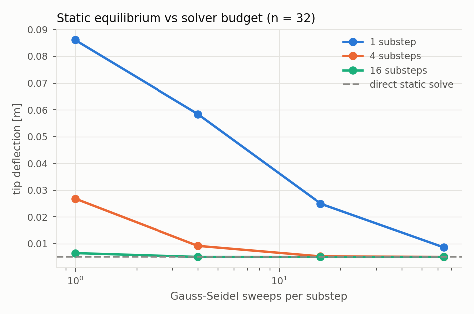
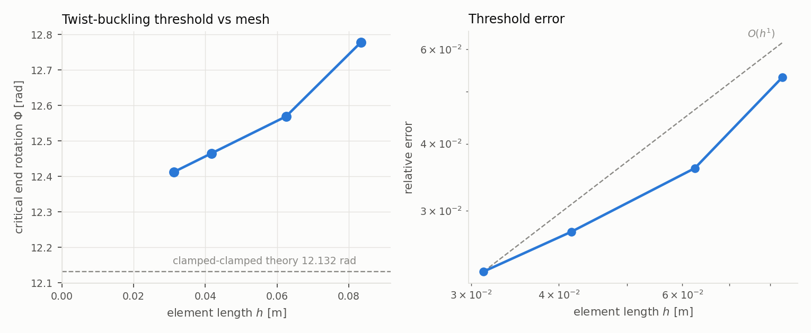
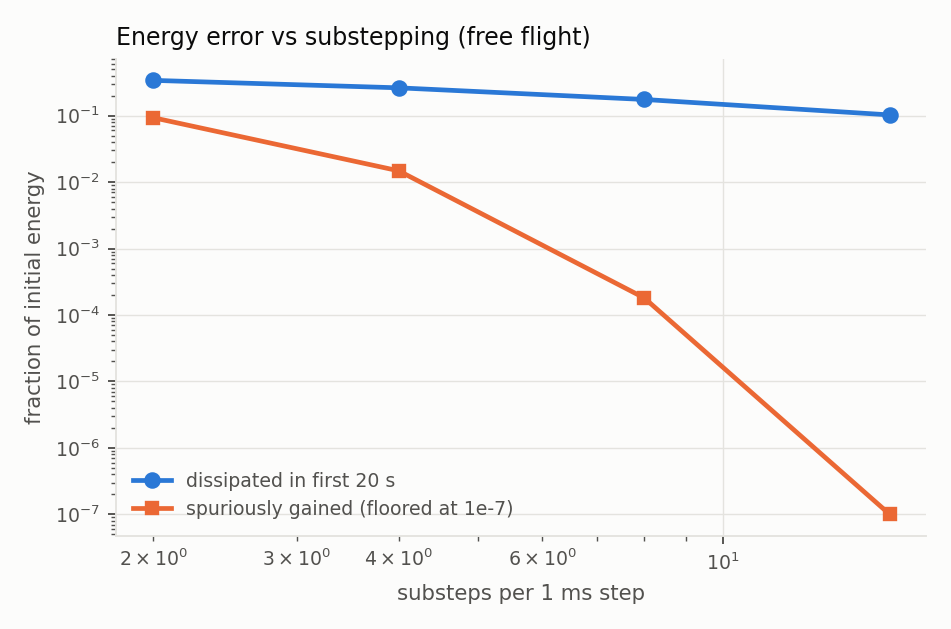
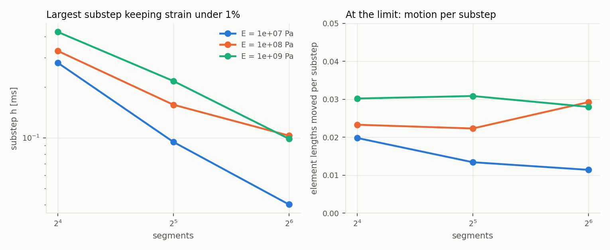
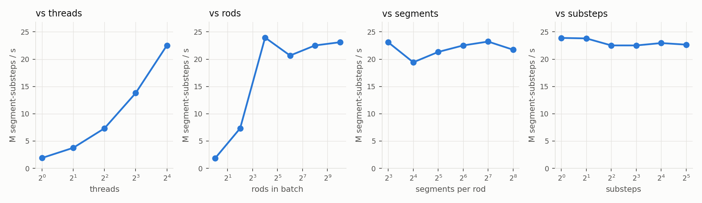

# A validated Cosserat rod solver, and what it took to trust it

This is the long-form companion to the [README](../README.md). It covers the
derivation, the compliance parameterization, contact and friction, the
constraint coloring and GPU design, what the measurements say about stability
and throughput, and — at the length it deserves — what is not established.

The short version of the method: every claim in this project is a number
produced by a case in `src/validation`, compared against a reference that does
not come from the solver. Several of those cases were wrong before they were
right, and the ways they were wrong are most of what is worth reading here.

---

## 1. The discrete rod

A rod of length `L` is split into `n` segments. It carries two kinds of state:

- `n + 1` **particles** `x_i` on the centerline, with masses lumped half and half
  from the adjacent segments;
- `n` **frames** `q_j`, unit quaternions mapping the segment's body frame to
  world. The body `e3` axis is the material tangent; `e1`, `e2` span the cross
  section. Each frame carries the body-frame inertia of a solid cylinder.

Two vector-valued constraints tie them together (Kugelstadt & Schömer 2016):

```
stretch/shear   C_s(x_i, x_{i+1}, q_j) = R(q_j)^T (x_{i+1} - x_i) / l  -  e3
bend/twist      C_b(q_a, q_b)          = (2 / lbar) Im(conj(q_a) q_b)  -  Omega_0
```

`C_s` is zero when the chord between particles has its rest length and points
along the frame's tangent. It is measured in the segment's **material frame**,
so its first two components are shear and the third is stretch for a rod
pointing in any direction. (Kugelstadt & Schömer write it in world components,
which is harmless with their single scalar stiffness; with the anisotropic
compliance of section 2 it is a bug, and this solver had it — see below.) `C_b` is the discrete Darboux vector — the rotation carrying one
frame into the next, per unit length — minus its rest value. Its first two
components are curvature, the third is twist.

### Jacobians under body-frame perturbations

Orientations are perturbed on the right, `q ← q exp(δθ/2)`, with `δθ` in the
body frame. That choice is what lets the diagonal body-frame inverse inertia be
used everywhere without a change of basis. Differentiating:

```
u = R(q_j)^T (x_{i+1} - x_i) / l
dC_s/dx_i = -R^T/l    dC_s/dx_{i+1} = +R^T/l    dC_s/dθ_j = [u]x

p = conj(q_a) q_b     (taken on the hemisphere of the identity)
dC_b/dθ_a = (1/lbar) (-p_w I + [p_v]x)
dC_b/dθ_b = (1/lbar) (+p_w I + [p_v]x)
```

For the stretch constraint the rotational block is `[u]x diag(Iinv) [u]x^T`,
which annihilates rotation about `u`. That is physics, not an accident: spinning
a segment about its own tangent does not move the tangent, so twist can only
enter through the bend/twist constraint.

The hemisphere choice matters. `q` and `-q` are the same rotation, but
`Im(conj(q_a) q_b)` flips sign between them, so without pinning the
representative the measured curvature can change sign mid-simulation.

### XPBD, with blocks

Each constraint is solved as a 3×3 system rather than component by component,

```
(J M^-1 J^T + alpha~) dlambda = -(C + alpha~ lambda)
```

by Cholesky. The system is SPD by construction: `J M^-1 J^T` is positive
semi-definite and the compliance on the diagonal is strictly positive. Solving
the block rather than its diagonal keeps the coupling between the shear and
stretch components, and between bending and twist, inside one projection.

The integrator is substepped XPBD (Macklin et al. 2019): predict with gravity
and body-frame gyroscopic terms, reset multipliers, run the Gauss–Seidel
sweeps, recover velocities from the position and orientation changes.

---

## 2. Compliance parameterization

The discrete elastic energy of an element is its length times the continuum
energy density:

```
E_s = (l / 2)    C_s^T diag(ks G A, ks G A, E A) C_s
E_b = (lbar / 2) C_b^T diag(E I, E I, G J)       C_b
```

XPBD writes an elastic potential as `E = ½ C^T alpha^-1 C`. Matching the two:

```
alpha_s = diag(1/(ks G A), 1/(ks G A), 1/(E A)) / l
alpha_b = diag(1/(E I),    1/(E I),    1/(G J))  / lbar
```

and XPBD uses `alpha~ = alpha / h²` with `h` the **substep**. At a static state
the XPBD fixed point reduces to `f_ext = J^T C / alpha`, which contains neither
`h` nor the number of segments. Stiffness is therefore the material's —
real `E`, `G`, `A`, `I`, `J` for a circular section — and a resolution sweep
changes the discretization error and nothing else.

That statement is exactly what the Phase 1 cases test, and it holds with two
conditions attached, both found the hard way.

**The system must actually be solved.** Gauss–Seidel on a rod is a chain, and a
sweep carries information about one element along it; the operator being
inverted is the fourth-order beam operator. An under-swept static relaxation
does not fail loudly. It settles into a stationary state that is genuinely too
**soft** and reports itself converged, because its velocities really are zero.
At `n = 64` a 512-sweep budget produced a 14% error that looked converged. The
`solver-convergence` case sweeps the budget explicitly, and the static cases use
a budget quadratic in `n`.

**The substep must be small enough for `alpha~` to dominate.** Even with
unlimited sweeps, a large substep left the pure-moment case with every joint
carrying 0.77% more moment than was applied — a converged, mesh-independent bias.
Quartering `h` removed it and restored second-order convergence.

**The compliance must be applied in the frame it is written in.** `alpha_s` is
diagonal in shear–shear–stretch, i.e. in the material frame. The first version
of this solver measured `C_s` in world components, so the axial stiffness `EA`
landed on world `z` whatever the rod's orientation: a cantilever along `x`
carried `EA` in shear, while the same rod along `z` was right. It went unnoticed
because the cases passed. `EA/ks GA ≈ 3` barely moves a slender rod's bending
answer, and with the static cases capped at `n = 64` the cantilever error was
still dominated by discretization. Refining to `n = 256` — affordable only once
the static solve was direct (below) — showed the error flattening out, and
Richardson extrapolation put the limit at `EB + 1.9e-5` against Timoshenko's
`EB + 5.7e-5`: a third of the shear deflection, which is `ks G / E`. Rotating
the rod to `z` gave slope 2.00 all the way down. The constraint is now in the
material frame on the CPU, the GPU kernel and the NumPy mirror, and the
cantilever case checks that a rod on an oblique axis deflects identically.

### Solving statics directly

The mesh-convergence cases ask a question about the **discretization** — does
its equilibrium converge to the continuum? — and needed nothing from the XPBD
iteration except its fixed point. They now get that fixed point directly
(`src/core/statics.cpp`). The unknowns are the free particle positions and a
body-frame rotation vector per segment, and equilibrium is

```
r = J^T alpha^-1 C - f_ext = 0
```

with applied torques converted into each body frame. Every constraint couples
neighbouring elements only, so with particle and segment DOFs interleaved the
Jacobian is banded (half-bandwidth 8: block tridiagonal in element pairs). It is
built by central differences of the exact residual, perturbing all DOFs more
than a band apart at once, so a Jacobian costs 34 residual evaluations at any
length; the solve is a banded LU with partial pivoting, because dead-load
torques make the Jacobian unsymmetric. Large deflections use load continuation,
halving a load step whose Newton iteration fails. The pure-moment half circle
converges in 17 Newton iterations in a single load step.

The XPBD solver is not taken on trust as a result: `solver-convergence` still
sweeps its budget, and now also checks that the richest budget lands on the
direct solution (gap 1.2e-8). The cantilever sweep went from 338 s at
`n ≤ 64` to under a second at `n ≤ 256`.



### Boundary conditions

The frame of segment 0 lives at `s = l/2`, not `s = 0`. Freezing it clamps the
rod half an element in, shortens the effective cantilever to `L - l/2`, and puts
an error of about `-1.5 h/L` into every static deflection: first-order
convergence from a second-order discretization, on a plot that still looks
respectable. The fix is a **ghost frame** — an orientation element with zero
inertia at `s = 0` — tied to segment 0 through a half-length bend element. Ghost
frames are ordinary entries in the state arrays, so the solver has no special
case for them, and rotating one about the tangent is how twist is imposed.


---

## 3. Validation, Phase 1

| case | reference | result |
|---|---|---|
| cantilever | Euler–Bernoulli / Timoshenko | slope 2.00; 7.6e-6 off Timoshenko at n = 256; frame invariant to 2e-12 |
| pure end moment | exact circular arc of radius `EI/M` | slope 2.01; 1.0e-4 at n = 128 |
| tip-load elastica | exact planar elastica by shooting | worst 6.3e-4 L |
| helix | `R = κ/(κ²+τ²)`, pitch `2πτ/(κ²+τ²)` | 2.2e-10 and 5.2e-4 relative |
| twist buckling | clamped–clamped Michell threshold | 2.3% at n = 32, converging |
| energy | conservation invariants | momentum to 1e-9; dissipation and gain shrink with substeps |
| cross-check | independent NumPy implementation | 4.7e-13 m after 200 steps |

Three of these deserve comment.

**The helix** first reported an 8% radius error on a rod whose residual elastic
energy was `1.4e-20` of its scale. The solver had found the exact rest state;
the *measurement* was wrong, because averaging tangents estimates a helix axis
without bias only over a whole number of turns. The axis is now taken from the
frame rotation, which is exact, and the residual-energy check stays in the case
as the thing that separates solver errors from measurement errors.

**Twist buckling** (Michell/Greenhill). Linearizing the Kirchhoff equations about
a straight rod carrying twisting moment `M` gives `EI w'''' - i M w''' = 0` for the
complex lateral deflection. With both ends clamped the solvability condition is
`θ = 2 atan(θ/2) + 2π`, so `M_crit L / EI = 8.986819` — not the textbook `2π`,
which is the pinned case. This was verified two ways (closed form and a
determinant scan) before any simulation was trusted.

The case needed three rewrites. Rotating the end frame straight to 12 rad asked
one half-element to hold 1.9 turns; the discrete twist lives in
`Im(conj(q_a) q_b)`, representable only inside (−π, π), so the constraint wrapped
it and the rod stored no twist at all. Constructing the uniformly twisted state
directly fixed that. The next version used static relaxation and found the
threshold 18% low — but raising the damping made the "buckling" vanish, which no
physical instability does. A heavily-iterated XPBD step is close to backward
Euler, and backward Euler damps genuinely unstable modes. The final case runs
honest dynamics (256 substeps, one sweep, no damping) and bisects on growth of a
seeded perturbation. It also checks the twisted base state's stored energy
against the *discrete* prediction: the discrete twist measure `2 sin(φ/2)/lbar`
stores about 2% less than the continuum at half a radian per joint, an `O(h²)`
difference that a check against the continuum value would have flagged as a bug.



**Energy** is not conserved, and the case does not pretend otherwise. XPBD is not
symplectic: this rod dissipates its elastic oscillation throughout the run. What
is asserted is what holds — dissipation and any spurious energy *gain* both
shrink monotonically with substeps (gain is exactly zero at 16), and linear and
angular momentum are conserved to round-off and 5e-4 respectively.



---

## 4. Contact, friction, self-collision

Every contact is the same constraint: up to four particles with weights and one
fixed normal, linearized as `C(x) = Σ w_k (x_k · n) − offset`, with the offset set
so `C` equals the signed gap at generation time. A rod-vs-world contact uses one
particle; a self-contact uses the four end particles of two segments, with
negative weights on the second, so the same expression is the relative gap. One
struct, one projection routine, no branches — which is the shape a GPU kernel
wants.

The normal multiplier is clamped at zero: contacts push, never pull. Friction is
applied straight after each contact's normal solve, at the position level: the
tangential displacement accumulated since the substep began is undone up to the
Coulomb bound `μ λ_n w_eff`. One expression covers stick and slip.

**That bound limits the total, not each sweep's share.** The first
implementation applied a fresh cap every Gauss–Seidel sweep, letting a solver
with four iterations spend four times the Coulomb limit. Friction four times too
strong still looks like friction; the symptom was a block sitting motionless on a
slope far steeper than `atan μ`.

Rod–world contacts are generated per particle: to the world the rod is a chain
of spheres of its own radius. That is exact for a plane and accurate for smooth
convex shapes while segments are not much longer than their diameter.
Self-collision uses segment–segment closest points behind a uniform spatial hash
built as key → counting sort → cell offsets — the same three stages a GPU
broadphase runs as key kernel → radix sort → scan.

**Self-contact pairs must be excluded by rest length, not by index.** When
segments are shorter than the rope's diameter, segments two apart are closer than
`2r` at rest. Skipping only direct neighbours made the solver push apart a rope
that was not touching itself — 74 spurious contacts on an untouched rope. The
exclusion now spans a diameter of rest length.

| case | reference | result |
|---|---|---|
| primitives | exact rest height on plane, sphere, capsule, box | 2.2e-16; penetration 5e-17 m |
| incline | slip at `tan α = μ`; `a = g(sin α − μ cos α)` | slip angle within 1.5%, sliding μ within 1.7% |
| capstan | `T₂/T₁ = e^{μθ}` at slip | 1.6%, 0.6%, 0.3%, 0.3% at ¼, ½, ¾, 1 turn |
| self-collision | no interpenetration during sustained contact | 13 simultaneous self-contacts; overlap 0.18% of diameter |

**The capstan** is the sharpest test here, because the answer is exponential in
both friction and wrap angle. Two things went wrong with it before it worked. At
a physical density a 0.25 mm rope lumps 1e-7 kg per particle and a 1 N pull
accelerates it at 1e7 m/s²; the simulation exploded. The threshold being measured
is static and does not contain the mass, so the rope's density was scaled up to
keep the slip-detection dynamics stable — a choice stated in the code. Then the
fit said friction was 14% weak at one turn. It wasn't: below the threshold the
rope creeps at ~1e-4 m/s while its lead-ins settle elastically, and an absolute
speed cutoff at that level let three creeping points into the linear fit. With a
cutoff relative to the fastest slip, the one-turn threshold is 4.796 against
4.811.


**Self-collision** also had a test that passed while proving nothing: a loop
meant to tighten onto itself never did, and "no interpenetration" held trivially
with zero contacts. The case now drops a rope into a coiling pile and asserts
that self-contact happened, as well as that nothing passed through anything.

---

## 5. Constraint coloring and the GPU design

Two constraints may run in parallel when they write no common state. Grouping
constraints into colours of mutually independent members turns a Gauss–Seidel
sweep into a sequence of parallel passes with no atomics. For a rod the conflict
graph is a path, and greedy colouring finds the optimum immediately: **two
colours** for stretch constraints (odd/even segments) and two for bend
constraints, at every resolution. The `coloring` case verifies both the count and
that no colour contains a conflict.

A coloured sweep is a different iteration from a sequential one — red-black
Gauss–Seidel converges to the same fixed point by a different path. A correct GPU
port will therefore *not* reproduce a sequentially-swept CPU trajectory. The CPU
solver can run in the coloured order for exactly this reason, and the GPU parity
case compares against that, while separately reporting how far the ordering alone
moves the trajectory.

### Two strategies

**Multi-kernel.** One launch per colour per sweep, plus predict and finish. With
8 substeps and one iteration that is 64 launches per step. General: indifferent
to rod length and colour count.

**Fused.** One block per rod, the rod's whole state resident in shared memory,
and the entire step — predict, every colour of every sweep, velocity recovery —
inside one launch, with `__syncthreads()` between colours. One launch per step
regardless of substeps, iterations or colours, and no trip to global memory
between sweeps. Its limit is the shared memory per block: the per-rod footprint
is `104 n + 24` bytes (quaternions first, so their 16-byte alignment needs no
padding), which bounds rod length and is queried from the device rather than
assumed.

The two want opposite layouts. Multi-kernel threads are (constraint, rod) pairs
with the rod varying fastest, so **element-major** storage (`element · numRods +
rod`) makes consecutive threads read consecutive addresses. A fused block walks
the elements of one rod, so **rod-major** (`rod · numElements + element`) is the
coalesced choice there. Rather than two copies of the physics, both strategies
read state through one view type — `base + element · stride` — which also covers
shared memory, so the projection routines never learn where they run.

The quaternion algebra is one templated header compiled as `double` on the host
and `float` on the device. Two hand-written copies of it would be the surest way
to fail a parity gate for reasons unrelated to the GPU.

### What has and has not run

The kernels build with CUDA 13.1 against MSVC 14.44 (the newer 14.50 in the same
install is rejected by nvcc; nvcc sees only kernel code, never the host-side
standard library). For most of the project they could not execute: driver 576.52
supported CUDA up to 12.9. After a driver update (616.92) they ran for the first
time on an RTX 3060 Laptop GPU, and passed.

**Parity.** The planned check — GPU within 1e-4 m of the colour-ordered CPU after
200 steps — failed at 2.9e-4 m. It was the tolerance that was wrong, not the
kernels. The CPU reference was built in single precision (`CRS_REAL_FLOAT`) and
compared against itself in double: the benchmark trajectory, a gravity-released
cantilever with one sweep per substep, amplifies rounding from 5e-9 m after one
step to 3.6e-7 m after ten and 2.5e-4 m after two hundred. The GPU follows that
curve almost digit for digit (5.43e-9 vs 5.43e-9 at step 1 for n = 16, 3.56e-7 vs
3.58e-7 at step 10). It also follows the colour-ordered iteration specifically: at
n = 128 after ten steps it sits 2.8e-8 m from the coloured CPU and 1.1e-5 m from
the index-ordered one. The case now checks parity after one step (tolerance
1e-7 m, where any kernel bug shows at full size), drift at 200 steps against the
measured float envelope, and exact agreement between the two strategies.

**Determinism.** 64-rod batches at 32 and 128 segments, three runs each, both
strategies: bitwise identical.

**Throughput** (unit: segment-substeps per second, as for the CPU):

| workload (64 segments, 8 substeps) | CPU, 16 threads | GPU multi-kernel | GPU fused |
|---|---|---|---|
| 1 rod | 1.8 M | 0.5 M | 5.8 M |
| 256 rods | 24.4 M | 125 M | 853 M |
| 16 384 rods | — | 654 M | **1 162 M** |

- **Launch overhead dominates small batches.** Multi-kernel issues 64 launches
  per step at 8 substeps; at one rod that is ~1 ms per step (~15 µs per launch),
  against 88 µs for the single fused launch — 11× apart.
- **The knee** is at about 1 024 rods for the fused path, where one block per rod
  fills the device; beyond it throughput is flat. Multi-kernel keeps climbing
  until ~16 k rods and saturates at ~0.6× the fused rate, the cost of reloading
  state between 64 launches.
- **Rod length** helps the fused path (1.1 B at 64 segments, 1.79 B at 256): the
  per-block synchronization cost is amortized over more constraints per colour.
  Multi-kernel is flat above 64 segments.
- **Substeps:** fused throughput rises 1.5× from 1 to 32 substeps (0.78 B to
  1.17 B) as the per-step load/store is amortized; multi-kernel is flat at
  ~0.62 B, since its launches scale with substeps.
- The fused path fits rods up to 383 segments in shared memory
  (`128 n + 36` bytes, including per-rod applied loads).


**Applied loads and driven ends.** Forces per particle, world torques per
segment and fixed-frame orientations are per-rod device state, set with
`Batch::setLoads`. The parity case has a second scenario with a tip force, a
mid-rod torque and a root frame twisted every step. It matches the CPU to
4.9e-8 m after one step, which is 0.4% of what those loads move the rod in that
step, so a device ignoring them would fail. Carrying the loads cost 4% of peak
throughput and cut the largest fused rod from 472 to 383 segments.

**Contact with the world.** Primitives and signed distances moved into a
templated host/device header (`src/core/geometry.h`), so the CPU and the kernels
share one implementation. Each rod has a fixed slot per (particle, primitive).
Slots are regenerated at the start of a substep, before prediction, as on the
CPU, and projected after both constraint colours in every sweep. Contacts on
different particles share no state, so running particles in parallel, with
primitives in order within each, is the same Gauss–Seidel sweep the CPU does.
No contact colouring is needed.

The first parity scenario for this was wrong in an instructive way. It started
the rod 1 mm *inside* the floor, and the first position correction launched it
upward at 8 m/s, so it barely touched anything again. The scenario now lets the
rod settle onto a floor 0.1 mm below and a sphere under its middle, with
friction. From about step 5 it rests in persistent contacts, up to 106 at 128
segments. After 200 steps the GPU sits 1.2–1.6e-7 m from the CPU, which is
exactly the float-vs-double envelope measured for that scenario. By step 50,
contact has moved the rod 1.3 cm, and the GPU error there is 1.3e-5 of that.
Contacts against two primitives cost 20% of fused throughput (0.92 B vs 1.15 B
at 16 384 × 64).

**Self-collision.** A self contact couples four particles, so contacts inside
one rod conflict. Colouring them each substep or averaging them Jacobi-style
would both change the iteration away from the CPU's. Instead, *finding* contacts
is parallel and *projecting* them is not:

1. Thread 0 builds the hash.
2. Every segment counts its contacts in parallel.
3. Thread 0 turns the counts into offsets in a per-rod pool.
4. Every segment writes its contacts at its offset in parallel.
5. The pool is projected in order.

That order is exactly the CPU's list order: segments ascending, the 3×3×3 query
in z/y/x, items ascending within a cell, bucket collisions included.

Two earlier versions were measured and discarded. Doing everything on thread 0
cut throughput by 50×, because a fused block is only as fast as its slowest
thread, and the broadphase is about 20× a normal thread's share of a sweep.
Moving that scratch into shared memory did not help, which is how latency was
ruled out as the cause. Fixed contact slots per segment overflowed, since one
segment can own 5 contacts in the coiling case. More slots did not fit a
block's shared memory. The pool holds half the segment count per rod, against a
measured peak of 37 for 150 segments, and it counts overflow.

Parity is checked by restart, because coiling is chaotic. The rope from the CPU
self-collision case is simulated on the CPU until it holds five self contacts.
That state is uploaded, and both sides take one step. The GPU lands 6.0e-6 m
from the CPU. The same CPU code built in single precision lands 1.8e-5 m from
the double build from that identical state, and even ends the step with a
different number of contacts (6 vs 8). The tolerance is 5e-5 m, and
self-collision itself moves the rope 6.8e-4 m in that step, 14× the tolerance.
Multi-kernel and fused agree exactly, and no contact overflows.

Self-collision is the expensive feature: about 0.09× the plain throughput at
16 384 × 64. The sequential projection is the part a future version would
colour.

No Nsight profile has been taken yet.

---

## 6. Application: will a cable stay on a hook?

A cable is draped over a horizontal bar and released. The grasp point sets
the leg ratio long/short; friction and stiffness are not in the robot's hands.
For an ideal flexible rope, the capstan equation over half a turn gives the answer:
it holds while `long/short ≤ e^{μπ}`. `src/apps/cable_hanging.h` defines the task
once, and it is used by the GPU sweep, its CPU cross-check and the demo scene.

**Sweep.** 30 friction values × 60 leg ratios × two cables (E = 1 and 3 MPa),
8 s each, takes 107 s on the laptop GPU. There is one batch per friction value,
because friction belongs to the world a batch shares. The soft cable's boundary
follows `μ = ln(ratio)/π` with a median offset of 0.033, always on the safe side:
the closest point sits 0.021 below theory, and none is above it. The stiffer
cable holds in 64% as many placements. Beyond a leg ratio of about 2.3 it holds
at no friction up to 0.6: bending stiffness, which the formula ignores, dominates.


**Two things went wrong on the way, and both are now checks.**

*Single precision invented static friction.* The first sweep used 16 substeps
and put the boundary 0.065 above theory, a suspiciously neat offset. The CPU,
in double precision, said those cables slip. Built with `CRS_REAL_FLOAT`, the
same CPU code said they hold. At 16 substeps gravity moves a particle g·h² =
3.8e-8 m per substep, but a float coordinate near 0.8 m can only change in steps
of 6e-8 m. The motion rounds away, velocity is recovered from rounded positions,
and a resting cable can never start to slide. At 8 substeps × 2 sweeps (the
same work) the margin is 2.6×, and float, double and theory agree. The case
asserts the margin and cross-checks the GPU against the CPU on exactly those
near-boundary placements.

*Friction creeps.* A 3 s window then matched theory to 0.006, but only because it
stopped watching. Rendering the demo caught it: μ = 0.25 on a 2:1 drape held at
3 s and was on the floor by 4 s. Even at μ = 0.5 a draped cable creeps about
2 mm/s, and μ = 0.28 held for 8 s and fell by 12 s. With an 8 s window the boundary
sits 0.03 above theory. Hold/slip is therefore stated for that window, and the
check requires the simulator never to be more optimistic than the ideal rope.
The likely cause is per-particle contact: a rope over a bar rests on a few
points, and which points touch keeps changing.

---

## 7. Application: a robot learns to route a wire harness

Wiring looms are still largely routed by hand. A worker pulls each cable along
a board, around pegs and into clips. `src/apps/harness_routing.h` defines one
such job: a 1.2 m, 8 mm cable plugged into a connector must pass **under peg A,
over peg B and through a clip**, laid against the pegs, not looped past them.
The pegs sit 6 cm off the connector–clip line, so a routed cable makes an S.
The robot's decision is its motion: five gripper waypoints on a fixed 5.3 s
schedule, smooth within each leg, sent as a constant velocity per 10 ms
control tick (so a GPU batch uploads velocities every 10 steps, not every
step). What it does not control is the cable: stiffness varies 0.4–4× (log-uniform),
friction 0.6–1.4×.

**Scoring.** Where the cable crosses the line x = peg.x decides the side. A peg
counts once the crossing is within 1.5 cm of touching. The clip counts when
the crossing lies between the post centres. For learning, each requirement
scores up to 1: a peg gets 1 when the cable is laid against its correct side,
fading to 0.5 further away and 0 on the wrong side, so 3 means routed. A first
version scored by distance from the peg and rewarded exactly the slack loops
the job forbids.

**Learning.** A cross-entropy method over the 10 waypoint coordinates, starting
from a hand-written motion. Each iteration samples 1024 motions and pairs each
with its own random cable, all in one GPU batch (`Batch::setMaterialScales`).
It then refits a Gaussian to the top 10%. Run as `rodsim harness-learning`:

| iteration | 1 | 2 | 3 | 4 | 5 | 6 | 7 | 8 | 9 | 10 |
|---|---|---|---|---|---|---|---|---|---|---|
| attempts routed | 2% | 9% | 26% | 40% | 59% | 73% | 81% | 81% | 79% | 86% |

Each iteration simulates 1024 × 6.3 s of cable (120 segments, 4 substeps × 4
sweeps, five contact primitives) in 12.6 s on a laptop RTX 3060. Ten take
127 s. The per-iteration rate includes the sampling noise. The final mean
motion routes **1024 of 1024 fresh random cables**. The hand-written motion
routes **0 of the same 1024**. On the reference cable it leaves a slack loop past peg A.

**Trust.** The softest and stiffest fresh cables are re-simulated on the
double-precision CPU under both motions. The verdicts match the GPU (4 of 4).
The learned motion also routes on the CPU at both corners of the range
(E × 0.4, μ × 1.4 and E × 4, μ × 0.6), which are the video's close-ups. The
material randomization itself was checked against CPU rods built with those
materials (`gpu-parity`).

**Two things the task needed first.** With the pegs on one line the routed
cable was a 1.6 cm wiggle: correct, but it did not show a robot doing anything.
The clip test also rejected cables resting against the inside of a post. Hard
pulls press the cable 1–2 mm into it, so "inside the gap" became "between the
post centres".

---

## 8. How large a timestep is accurate

"XPBD is unconditionally stable" is true in the sense that it rarely explodes,
and that is exactly why it is the wrong question. A rod can run for ever
without exploding while stretching like rubber. The useful question is how
large a substep keeps the rod behaving like the material it was given.

**Two earlier answers in this repository were wrong.** The first blamed the
predictor displacement `h² f / m`. That was inferred and never isolated. The
second measured the largest timestep before *energy* ran away, and found a
tidy law: breakdown at 0.66 element lengths of motion per sweep, independent of
stiffness. That law came from the stretch/shear frame bug (§2). With the bug
fixed, the same measurement moved 5–20×, and whether a run exploded stopped
being monotone in `dt`: a 128-segment rod blew up at 1 ms yet survived 3–10 ms.
Tracing runs near that "limit" showed why it never measured anything useful.
In both versions the constraints were barely solved: axial strain up to 80%,
shear up to 265%, and the energy criterion called those runs stable.

**The measurement now.** A cantilever released from horizontal swings down for
one second. Accuracy is the worst stretch/shear strain anywhere in the rod at
any time. The physical strain of this motion is small (7e-4 at `E = 1e8`, 5e-5
at `1e9`), so strain beyond 1% is solver error. Worst strain rises smoothly
with `dt` in every configuration scanned (`rodexp scan` shows the old criterion
flipping; a strain scan over the same grid is monotone), so bisection on it
means something. `E = 1e6` is excluded: that rod strains 4–10% physically in
this swing, so no timestep meets a 1% tolerance.

Only the substep `h` matters, not how substeps are grouped into frames, since a
frame of four substeps *is* four substeps. The case therefore reports the
largest accurate `h`.

What it found, over `E = 1e7…1e9` and 16–64 segments:

- **The limit is kinematic.** At the limit, material moves **1.1–3.1% of an
  element length per substep** (`v h / l`, with `v = √(2gL)`). That is a 2.7×
  spread across a 4× range of mesh and two decades of stiffness. Refining the rod
  shrinks the usable substep in proportion to the element length, so refinement
  costs twice: more segments, and proportionally more substeps.
- **Stiffer rods tolerate a larger substep, not a smaller one.** From
  `E = 1e7` to `1e9` the limit grows 1.5× at 16 segments and 2.3–2.5× at 32–64.
  Implicit compliance is what makes stiffness free.
- **Iterations versus substeps depends on stiffness.** Four sweeps spent as
  iterations allow 1.9× the `dt` of four substeps on the softest rod and 0.28×
  on the stiffest. The case reports this and asserts neither.

What is asserted: every configuration is bracketed, and the motion per substep
at the limit is a few percent of an element within a 4× spread. It is still
one scenario, a gravity swing. Contact-driven and whipping motion are not
covered.



---

## 9. Throughput (CPU)

Batched independent rods, stepped across threads. The unit is segment-substeps
per second, because a substep is the unit of solver work and counting frame steps
would let a low substep count inflate the number.

- **Peak 23–25 M segment-substeps/s** on 16 threads (23.2 M and 24.0 M in two
  separate runs, 24.8 M after the material-frame fix; the video shows the first).
- **Thread scaling:** 1.90 M on one thread to 22.1 M on sixteen, 11.6×.
- **Batch size:** 1.9 M for a single rod, 14 M at 16 rods, flat above ~64 rods —
  below that, per-thread work is too small to amortize thread startup.
- **Rod length and substeps:** flat. Cost is linear in work; nothing is
  super-linear.
- **Measurement spread:** the same configuration, measured five times across the
  sweeps, ranged 21.6–23.2 M — about 7%. Differences smaller than that in these
  curves are noise.

In the demo scenes the draped cable (120 segments, 8 substeps, 2 iterations,
contacts and self-collision) runs **3.2× faster than real time on one thread**,
and 256 independent rods run **1.7× faster than real time on sixteen**.



---

## 10. Limitations

This is the section that matters most, so it is specific.

- **The GPU path is partial.** Parity, determinism and throughput are measured
  (§5) for every feature, but self-collision costs about 11× in throughput,
  and there is no profiler output.
  GPU parity is established to float rounding, not bitwise against the CPU.
- **The timestep envelope is one scenario deep** (§8): a gravity swing, 16–64
  segments. Contact-driven and whipping motion are not covered.
- **The demo scenes were simulated before the material-frame fix** and should
  be re-run.
- **Twist buckling** is first order over n = 12–32 and 2.3% off at the finest
  mesh.
- **Energy is dissipated,** not conserved. Only its convergence with substeps is
  established, over 2–16 substeps.
- **Contact is simplified.** Rod–world contact is per particle (a chain of
  spheres), valid while segments are no longer than about their diameter;
  contacts apply no torque to frames, so rolling and torsional friction are
  absent.
- **Friction validation is narrow:** one incline geometry and one capstan
  coefficient (μ = 0.25). The capstan rope's density is unphysical by design.
- **The stability rule is one scenario deep** and restricted to elements longer
  than the rod's diameter.
- **The demo video's simulations ran on the CPU,** and it says so on screen,
  with the measured wall-clock cost per simulated second.
- **The harness policy is open loop:** five waypoints on a fixed schedule, no
  sensing. It is robust across the randomized cables, not to a board that
  moves or a cable that starts somewhere else.
- **Not attempted:** the optional Python binding, and the distribution work in
  the plan, which is not engineering.

## 11. What I would build next

Update the driver and run the three GPU cases — parity first, because a fused
kernel that is fast and wrong is worth nothing. Then replace the relaxed static
solves with a direct block-tridiagonal solver so the validation suite runs in
seconds and can genuinely gate every commit.
